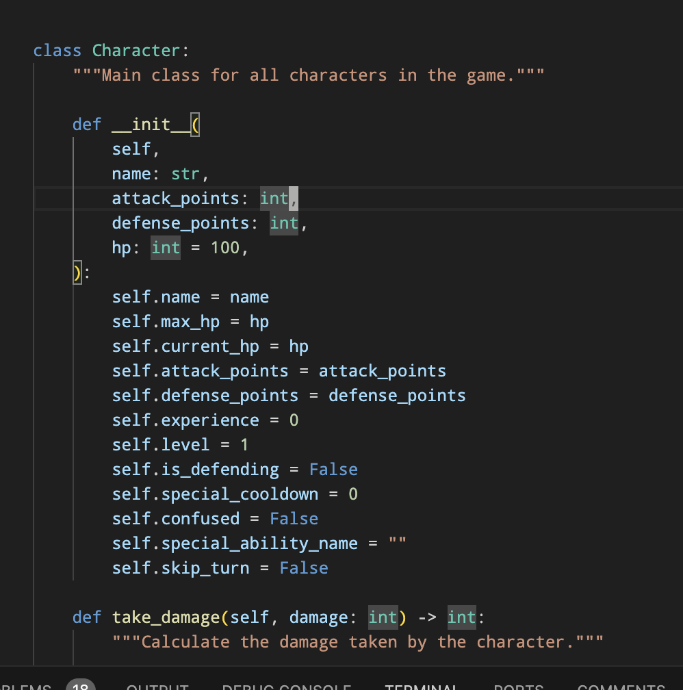
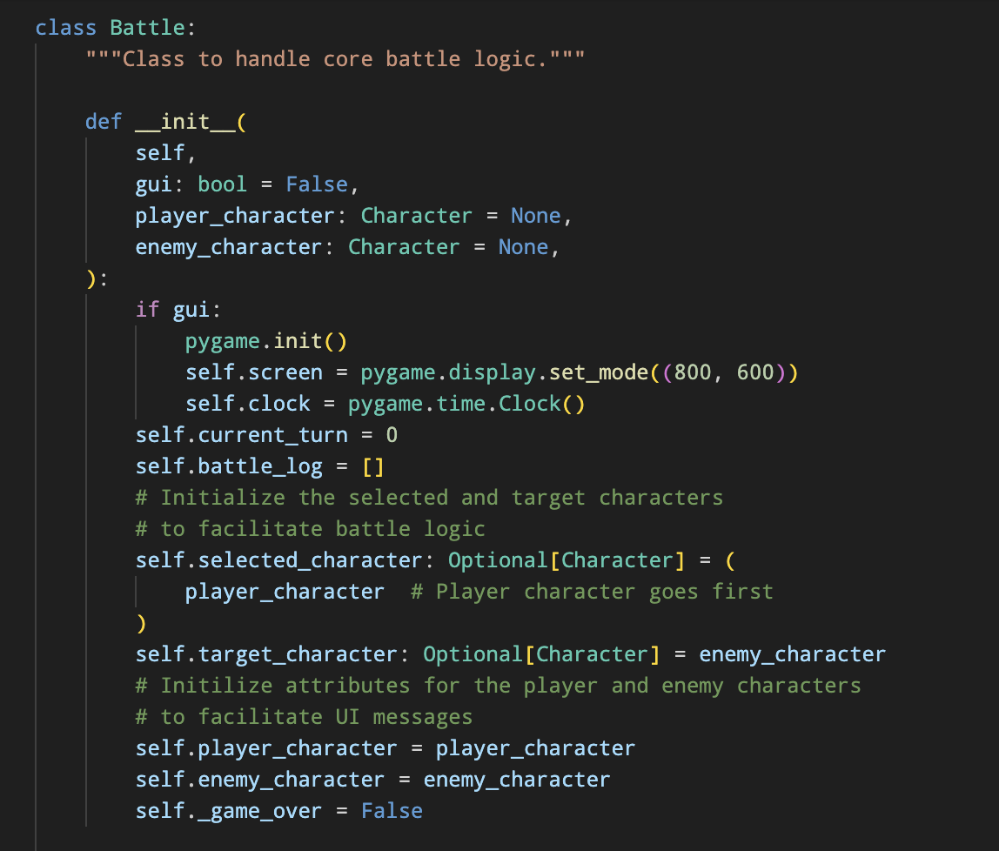
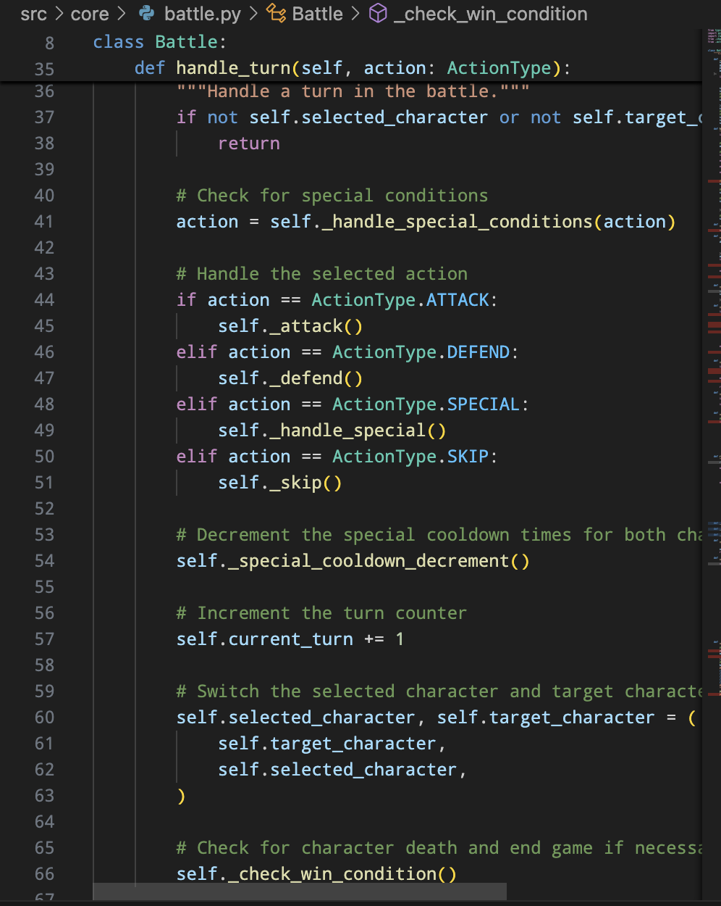
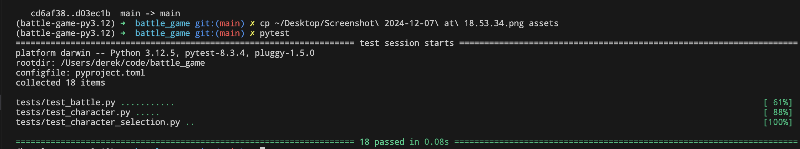
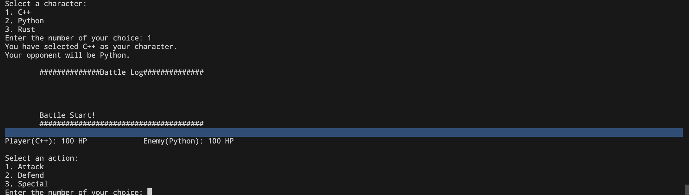
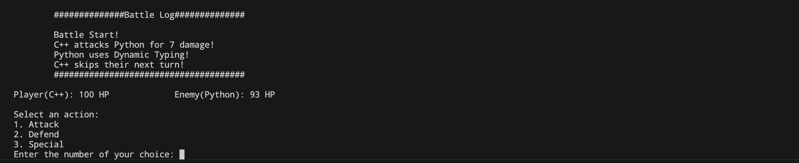
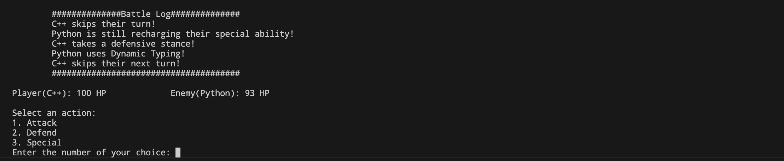
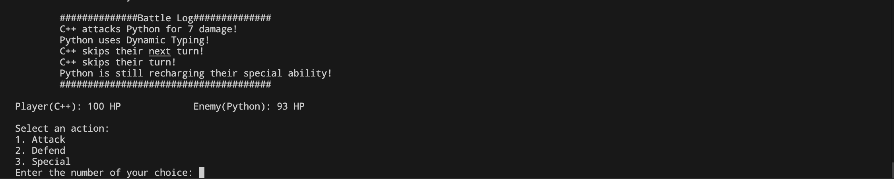
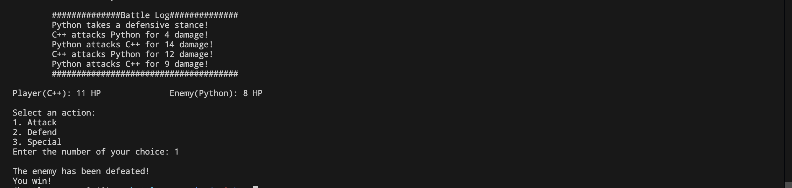

# Battle Game
Turn-based text battle game

## Table of Contents
- [Installation Instructions](#installation-instructions)
- [Explanation of Game Mechanics](#explanation-of-game-mechanics)
- [Tests](#tests)
- [Gameplay Screenshots](#gameplay-screenshots)

## Installation instructions

Dependency and package management is handled by poetry. Make sure poetry is installed using your system's package manager
such as homebrew or apt, or install with curl:
```bash
curl -sSL https://install.python-poetry.org | python3 -
```

Ensure you have python version 3.12.5 installed using your preferred tool. For example, install with pyenv using:
```bash
peynv install 3.12.5
```

Install project dependencies and activate the virtual environment using:
```bash
poetry install
poetry shell
```

Finally, run the game with 
```bash
./run_game.sh
```

## Explanation of game mechanics
The game follows an object-oriented paradigm where the main objects facilitating gameplay are the Character and Battle classes. 

### Character Class
The character class has all the core attributes and methods pertaining to characters. Each game is initialized with a player character and non-player character, of which their are three sub-classes that inherit most of their methods from the main character class. These sub-classes have special abilities that are specific to their names/descriptions which have unique effects in a battle.

The core character class has attack, defense, and hit points. Defense points are subtracted from attack points when calculating the damage a character does to another, including a die roll from -5 to 10 to introduce some randomization. Each character is initialized with 100 hit points, and when they reach zero, they die and the game ends. The character subclasses also have a few special conditions, such as confusion. If a character is confused, they randomly select their next action. The enemy character has some basic AI which selects actions based on how many hit points it currently has. There is a preference for defense (which halves incoming damage) if the character is below 50hp. 


### Battle Class
All of the core game mechanics are brokered by the battle class. It's primary mechanism is the main game loop which handles each turn, taking into account who's turn it is, logging actions to the battle log, and accounting for special conditions (such as when a character is below 50 hp, or a character is confused). The Battle class also has methods to handle interactivity with the user, providing the current game state each turn, as well as prompting for input to select a character action.

The below screenshot shows the method that handles most of the core game logic. The handle_turn method is called with an ActionType enum which defines what will happend during that turn. The _handle_special_conditions method is called, potentially changing the ActionType for that turn if a character is confused or there is another special condition in play. It then decrements the cooldown for each character's special condition (which can only be used every three turns). The turn counter is incremented, and the selected and target characters are switched (effectively ending the turn). Finally, the method checks if either of the characters are dead, and handles a game over status if that's the case.


## Tests
Pytest is the main testing framework used in this project. Because the Battle class is the most heavily used class handling core game logic, it has the most unit tests.


## Gameplay screenshots
Game start

Attack Action

Defend Action

Special Action

End game
